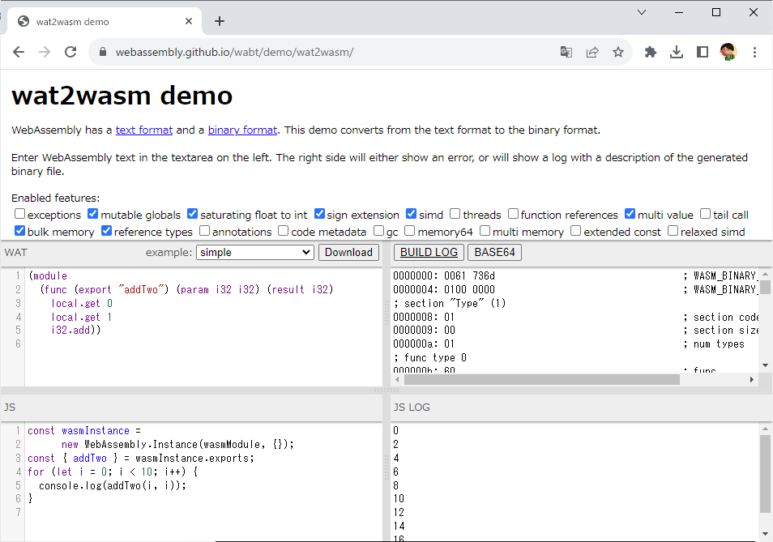

# nodejs_wasm_example1

## 概要

* wasm ファイルを nodejs で実行するサンプル
* ビジネスロジックを wasm で作れば言語に依存しないライブラリとして使用できないか？

## 環境

```
> node --version
v20.5.1
```

## 詳細

* 今回はとりあえず動かしてみたいだけなので wat2wasm demo を使って足し算の関数が実装された wasm ファイルをダウンロード
* main.js に上記の wasm ファイルをロードして関数を実行する処理を記述
* `node main.js` を実行  
  結果
  ```
  > node main.js
  7 + 4 = 11
  ```

wat2wasm demo  
https://webassembly.github.io/wabt/demo/wat2wasm/


## 参考

開発ツールに頼らず 様々な言語から WebAssembly（第１回）  
https://qiita.com/wbcchsyn/items/e1f699bb86c466411e36#vanilla-js-%E3%81%8B%E3%82%89%E5%AE%9F%E8%A1%8C  


